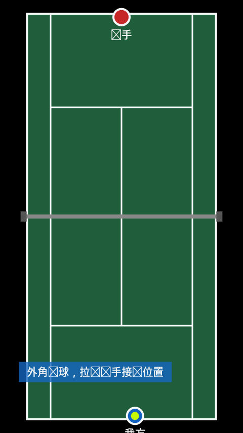
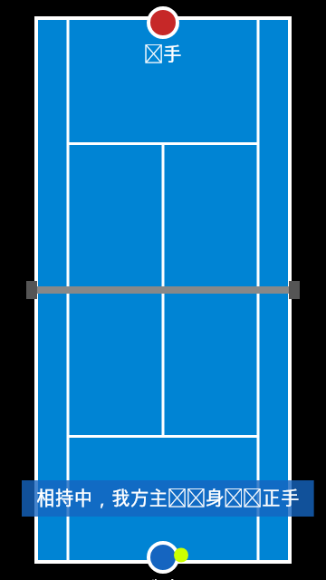

# tennis_tactic - Tennis Tactics Animation Scripts

English | [中文](README.md)

A collection of tennis tactic demonstration animations described in **ASDL (Animation Script Description Language)**. Each tactic is a self-contained JSON file containing the animation script (court / players / ball / timeline) plus accompanying descriptions (introduction, purpose, when to use, key points).

Designed for tennis enthusiasts, coaches, and app developers to use directly or build upon — render the scripts with your own player, or adapt existing scripts into new tactics.

> This repository contains only **tactic script data, the protocol documentation, and a web player**. No app or backend code is included.

**Serve and Volley** (grass · singles) · **Inside-Out Forehand Winner** (hard · baseline)

<p>
  
  
</p>

## Online Preview

Once pushed to GitHub, the Pages workflow (`.github/workflows/deploy-pages.yml`) deploys the web player automatically — no clone needed:

**[https://panwei321.github.io/tennis_tactic/viewer/](https://panwei321.github.io/tennis_tactic/viewer/)**

> First-time setup: in **Settings → Pages → Build and deployment → Source**, choose **GitHub Actions** (one-time).

## Quick Start (local)

```bash
git clone <this repository>
cd tennis_tactic

# Serve locally (the viewer must be accessed over http; opening the html file directly fails to load data)
python3 -m http.server 8080

# Open in browser
http://localhost:8080/viewer/
```

Pick a tactic from the left sidebar to play it: drag the progress bar, change playback speed, and read the tactic descriptions. Append `?id=<tactic-id>` to the URL to jump straight to a specific tactic and share the link.

## Repository Layout

```
tennis_tactic/
├── tactics/                # Tactic scripts (one file = one tactic)
│   ├── singles/            #   Singles tactics (8)
│   ├── doubles/            #   Doubles tactics (3, four-player elements)
│   └── baseline/           #   Baseline tactics (example)
├── docs/
│   ├── asdl-spec.md        # ASDL protocol spec (read this for secondary development)
│   ├── asdl-schema.json    # JSON Schema (editor autocomplete / machine validation)
│   └── images/             # Doc images (README demo GIFs, etc.)
├── viewer/                 # Web player (zero dependencies, embeddable)
│   ├── index.html          #   Library page (?id= permalinks, search, speed control)
│   ├── tactic-preview.js   #   ASDL playback engine (Canvas 2D reference implementation)
│   ├── viewer.js / viewer.css
│   └── tactics.json        #   Index file (generated by tools/build-index.js, do not edit)
└── tools/
    ├── export_tactics.sql  # Export tactics from a MySQL business DB (maintainer use)
    ├── import_export.js    # Split the export into single files under tactics/
    ├── build-index.js      # Validate all scripts (incl. JSON Schema) and rebuild the index
    └── render-gif.js       # Headless-render any script to GIF (no browser/ffmpeg needed)
```

## Tactic File Format

Each JSON file under `tactics/` is a "wrapped tactic": metadata and descriptions on the outside, and an ASDL-compliant animation script in the `script` field.

```json
{
  "id": "inside-out-forehand",
  "name": "Inside-Out Forehand Winner",
  "category": "Baseline tactics",
  "introduction": "One-line introduction…",
  "purpose": "What this tactic tries to achieve…",
  "scenarios": "When to use it…",
  "tips": "Execution points and common mistakes…",
  "protocolVersion": "1.0",
  "script": {
    "meta":     { "id": "…", "name": "…", "duration": 4300, "version": "1.0", "author": "…" },
    "court":    { "width": 720, "height": 1280, "courtRect": { "x": 80, "y": 40, "w": 560, "h": 1200 }, "netPosition": 640 },
    "elements": [ { "id": "attacker", "type": "player", "label": "Us", "initPos": [360, 1230] }, "…" ],
    "timeline": [ { "t": 0, "actions": [ "…" ] } ]
  }
}
```

The coordinate system, action types (`text` / `move` / `trajectory`), and easing functions are covered in **[docs/asdl-spec.md](docs/asdl-spec.md)**. A machine-validatable definition is available at **[docs/asdl-schema.json](docs/asdl-schema.json)** — associate `tactics/**/*.json` with it via `json.schemas` in VS Code for autocomplete and instant validation.

## Secondary Development

**Just want the data**: read `viewer/tactics.json` (or files under `tactics/`) and implement your own renderer following the ASDL spec. The protocol is pure JSON and platform-agnostic — Canvas, SVG, or native animations all work.

**Want to play it in a web page**: include two files, zero dependencies:

```html
<canvas id="court" style="width: 360px"></canvas>
<script src="viewer/tactic-preview.js"></script>
<script>
  const player = new TacticPreview(document.getElementById('court'), {
    onTimeUpdate: (cur, dur) => {},   // optional: progress callback
    onStateChange: (s) => {},         // optional: playing / paused / completed
    onError: (msg) => {}              // optional: script errors
  });
  fetch('viewer/tactics.json')
    .then(r => r.json())
    .then(list => player.loadScript(list[0].script));  // accepts an object or a JSON string
  player.play();
</script>
```

**Want to contribute or adapt tactics**: copy the closest existing script, modify its `timeline` and descriptions, then run `node tools/build-index.js` — once validation passes and the tactic plays correctly in the viewer, it is ready to submit (see [CONTRIBUTING.md](CONTRIBUTING.md)).

## Data Export (maintainers)

To import scripts from the source business database (`tools/export.json` is gitignored):

```bash
# 1. Export (replace placeholders with your connection info)
mysql -h <host> -P <port> -u <user> -p --default-character-set=utf8mb4 -N <dbname> < tools/export_tactics.sql > tools/export.json

# 2. Split into single files under tactics/
node tools/import_export.js

# 3. Validate + rebuild the index
node tools/build-index.js
```

## Generating Preview GIFs

Any tactic script can be rendered to a GIF in one command (drives the player frame by frame — no browser, no ffmpeg):

```bash
npm install   # toolchain only: @napi-rs/canvas + gifenc + ajv
node tools/render-gif.js tactics/singles/tactic-serve-wide-approach-volley-v9.json docs/images/demo.gif
# optional flags: --width=360 --fps=10
```

The two demo images at the top of this README were generated with this command.

## Contributing

New tactics, animation fixes, and description improvements are all welcome — see [CONTRIBUTING.md](CONTRIBUTING.md).

## License

[MIT](LICENSE). Tactic content is for learning and exchange only; please practice safely under proper guidance.
